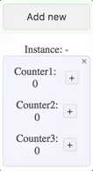

# Example usage of [vuex+](https://github.com/presidenten/vuex-plus)

## Introduction
This demo shows how to use [vuex+](https://github.com/presidenten/vuex-plus) to get instances from [vuex module stores](https://vuex.vuejs.org/en/modules.html) as well as vuex HMR through the  [webpack-context-vuex-hmr](https://github.com/presidenten/webpack-context-vuex-hmr) webpack plugin.

This project is based upon the [vue-cli webpack template](https://github.com/vuejs-templates/webpack), and been modified to show some examples of working with dynamic creation/destruction of component instances with dynamic vuex stores for each instance.

### Heads up
The main purpose of this project is to show some examples of how to get things done with `vuex+`. I kept things as simple as possible with only super simple counters implemented everywhere, to keep the focus on `vuex+`,
The thought behind the code structure is to keep things that use each other close. Only very light logic goes into vue components, heavy logic goes into vuex models and services.


## Getting started

- Clone this [repo](https://github.com/presidenten/vuex-plus-demo.git)
- Install dependencies by running `yarn`or `npm install`
- Run tests with `npm run test`
- Start the dev server `npm run dev`
- Open http://localhost:8080 and a devtools window with javascript console
- Click around, check console, vue devtools and mess with the code to get a feel for it.

## Vuex+ Basic concepts
- **Root level modules**
  Root level modules, named `filename-store.js`, are at the top level of the state tree.
  Only root level module instances may dynamically be created and added and removed during runtime. Although nested modules in the instance subtree may be instantiated, the instances must be specified statically in the `modules` property when exporting the substore.
- **Submodules**
  All other modules are submodules and will be named `filename-substore.js`. These can be used as is or as instances in a root level module or a submodule. Their state will always be present as a substate to some root level module while it is alive.
  They are however more flexible as they can be easily reused.
- **Component mapping**
  Components will be mapping _one_ namespaced module which ties them together. Root level modules may live or die with their components, while subcomponents are more like a loose view. Also:
  - Root level modules must use `register(file-name-without-dot-js)` as a mixin. As this will register a new module to the root state when the component is created.
  - Submodules only need to map a stores actions or getters and be placed used so that the nearest parent that vuex+ maps a module is one using the submodule. This will automatically make the components tie into the correct submodule instance and namespacing will be handled.

## Vuex+ Tutorial
### Basic usage of instances
Components mapping root level modules with the Vuex+ `mixin`, gets two registered properties; `instance`and `preserve`.

  - Instance
    Setting `instance` to a unique identifier creates a new instance. Setting `instance` to an existing identifier will use the same instance.
    In this example the first two elements share store instance while the third has its own store instance.
    ```html
    <counterGroup></counterGroup>
    <counterGroup></counterGroup>
    <counterGroup instance="foo"></counterGroup>
    ```
    


  - Preserve
    Set `preserve="true"` to keep the state from beeing discarded when the last instance is removed.


    | false                           | true                            |
    |---------------------------------|---------------------------------|
    |  |  |

### Writing Vuex+ modules
Writing a module is very similar to writing a normal [vuex module](https://vuex.vuejs.org/en/modules.html), except the filename should end with `-store.js` for root level modules and `-substore.js` for submodules.

This is the general format:
```javascript
// Import store wrapper from vuex+
import { store } from 'vuex+';

// Setup an initial state
const initialState = {
  count: 0,
};

// Write getters in an object as usual
const getters = {
  count: state => state.count,
};

// Write action in an object as usual
const actions = {
  increase(context, amount) {
    // Commit local module mutations with mutation name as string
    context.commit('increase', amount);
  },
};

// Write mutations in an object as usual
const mutations = {
  increase(state, amount) {
    state.count += amount;
  },
};

// Export the vuex module wrapped in the `store` function
// The `vuex+-loader` adds `name` and Vuex+ enforces namespaced: true,
export default store({
  state: initialState,
  getters,
  actions,
  mutations,
  modules: {
    // submodules, goes here
  },
});
```

### Using $parent
The state in modules getters/actions/mutations has got a `$parent` property that references the parent state. This helps reading state up the dependency tree and lateral from the modules position without having to know its exact position.
```javascript
const getters = {
  parentCount: state => state.$parent.count,
};
```

### Mapping root level modules to components
To register a root level module, there is a Vuex+ property that generates a mix that registers the module to the root store. The property `register` take a pathless filename without `.js`. It can be used directly in the components [mixin](https://vuejs.org/v2/guide/mixins.html) property. Parent components may now use `instance` and `preserve` properties when creating the mapped component.

Here is an snippet from `./src/components/counter-group/counter-group.vue` in the repo:

```javascript
<script>
  // Import `map` and `register`
  import { map, register } from 'vuex+';

  export default {
    mixins: [register('counter-group-store')], // filename without .js

    computed: {
      // Map the getters of interest.
      // The path will be the camel cased filename without `-store`.
      // Namespacing and instances is handled and added automatically
      ...map.getters({
        count: 'counterGroup/count',
      }),
    },
    methods: {
      // Same with actions
      ...map.actions({
        increase: 'counterGroup/increase',
      }),
    },
    ...
  };
</script>
```

### Mapping submodules
Mapping submodules is much more straight forward. Just map the submodules local path. When the component is used as a descendant to a module that has this submodule in its `modules` property, the namespacing and instancing will work itself out automatically.

Here is an example from `./src/components/counter-group/another-counter/another-counter.vue` in the repo:

```javascript
<script>
  import { map } from 'vuex+';

  export default {
    computed: {
      ...map.getters({
        count: 'anotherCounter/count',
      }),
    },
    methods: {
      ...map.actions({
        increase: 'anotherCounter/increase',
      }),
    },
    ...
  };
</script>
```

### Submodule instances
Submodule instances can only be created when used in a parent module. Submodules are created by using the Vuex+ `newInstance` function. The resulting object is then inserted into the `modules` property like usual.
An example can be found in `./src/components/counter-group/another-counter/another-counter-substore.js`:


```javascript
import { store, newInstance } from 'vuex+';
import counter from '@/common/counter-substore.js';

const counter$foo = newInstance(counter, 'foo');
const counter$bar = newInstance(counter, 'bar');

export default store({
  ...
  modules: {
    counter$foo,
    counter$bar,
  },
});
```

In the component, instance names are set on the stores bound component:
```javascript
<subCounter instance="foo"></subCounter>
<subCounter instance="bar"></subCounter>
```


### Using Vuex+ `root` to Get/Dispatch/Commit
Sometimes there is a need to read a getter from the parent module, a lateral module or the instance root module.
When using `root` and passing the context state, the paths have keywords that expand automatically to help with this:
- `'$parent/path'` - expands to a path starting from the parent
- `'$root/path'` - expands to path starting from the the instance root module

If module is `c` in the dependency tree `a/b$foo/c`:
```javascript
  root.get({ path: '$root/someGetter', state: context.state });
  // expands to root.get({ path: 'a/someGetter' });

  root.get({ path: '$parent/someGetter', state: context.state });
  // expands to root.get({ path: 'a/b$foo/someGetter' });
```
It can of course also be used for `dispatch` and `commit`.

An extensive example of using different ways to read/dispatch actions from vuex module can be found in: `./src/components/counter-group/another-counter/another-counter-substore.js`.

### Writing tests
Since the vuex modules dont really know anything about the instance handling, tests are pretty straight forward and isolated.
There is an example on how to test modules in `./components/item-list/item-list-store.spec.js`.

Testing is done with a mock `state` object that is passed into the modules getters, actions, and mutations. Spies are attached to `context.commit` and `context.dispatch` to verify that they are called as planned.

- Testing getters: Inject state and verify outcome

- Testing actions: Inject state and the spied context and verify that the actions dispatches and commits as planned

- Testing mutations: Inject state and verify changes

### Gotchas
- Binding a getter to computed before the module is created will give console error, and then the binding wont work.


### How to setup Vuex+
In `./src/main.js` vuex+ is imported and used as a Vue-plugin and a Vuex-plugin.
The important thing is that `./app.vue` is loaded **_after_** vuex+ has been setup.
```javascript
import Vue from 'vue';
import Vuex from 'vuex';
import VuexPlus from 'vuex+';

Vue.use(Vuex);
Vue.use(VuexPlus.getVuePlugin(Vue));

// Create the Vuex store
const store = new Vuex.Store({
  strict: process.env.NODE_ENV !== 'production',
  plugins: [VuexPlus.getVuexPlugin(Vuex)],
});

/* eslint-disable */
new Vue({
  el: '#app',
  store,
  render: h => h(require('./app.vue')),
});
```

## Under the hood
Differences from [Vue-cli webpack template](https://github.com/vuejs-templates/webpack) is mainly in `./build/webpack.base.conf.js`:
- Resolve `vuex+` as `vuex-plus`
```javascript
resolve: {
  alias: {
    'vuex+': 'vuex-plus',
  }
},
```
- Use `vuex+` loader to add names to module stores
```javascript
module: {
  rules: [
    {
      test: /-(store|substore)\.js$/,
      loader: 'vuex-plus/loader',
    },
  ],
},
```
- Vuex HMR setup:
```javascript
plugins: [
 new (require('webpack/lib/ContextReplacementPlugin'))(
   /webpack-context-vuex-hmr$/,
   path.resolve(process.cwd(), './src'),
   true,
   /-store.js|-substore.js$/
 )
],
```

- Using [jest](https://github.com/facebook/jest) for testing

# License
MIT
